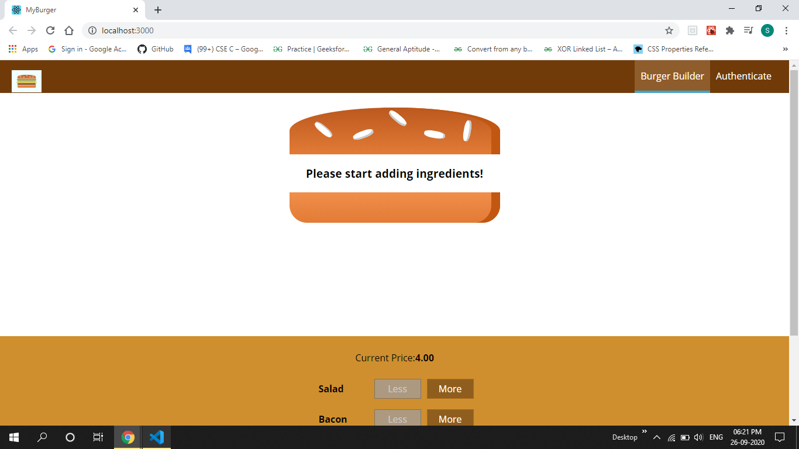
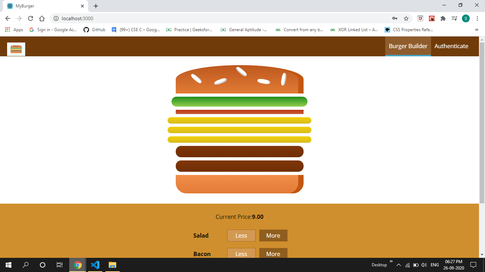
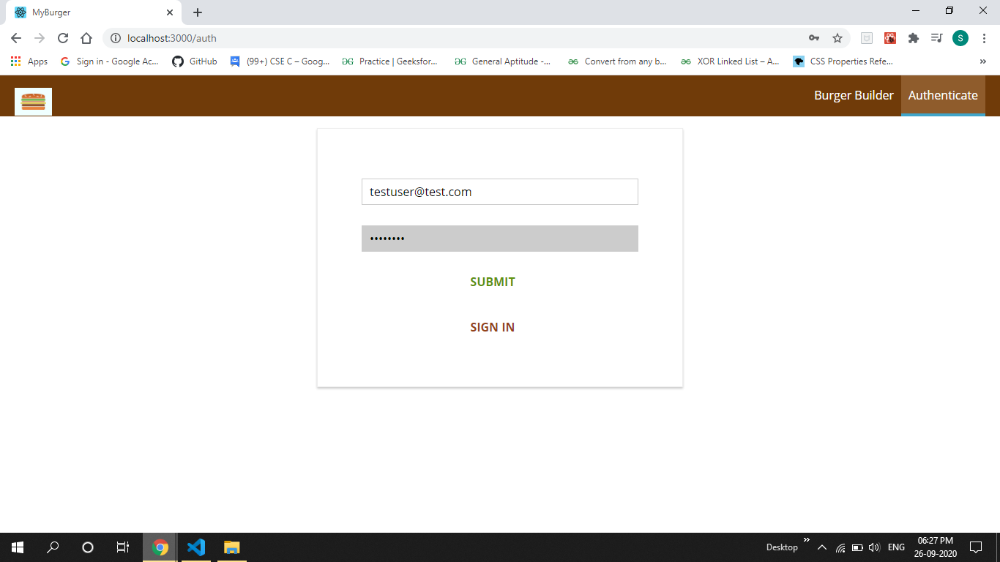
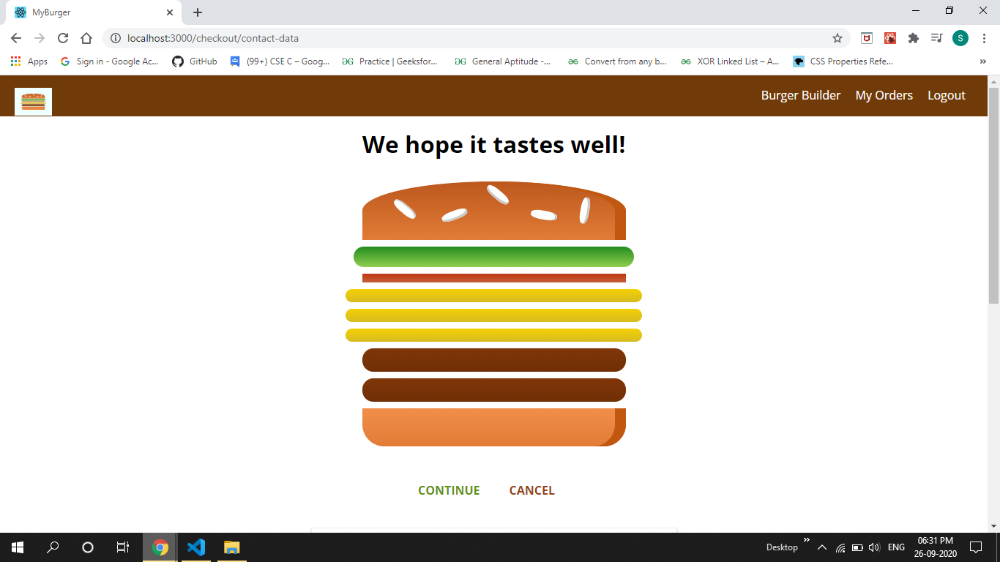
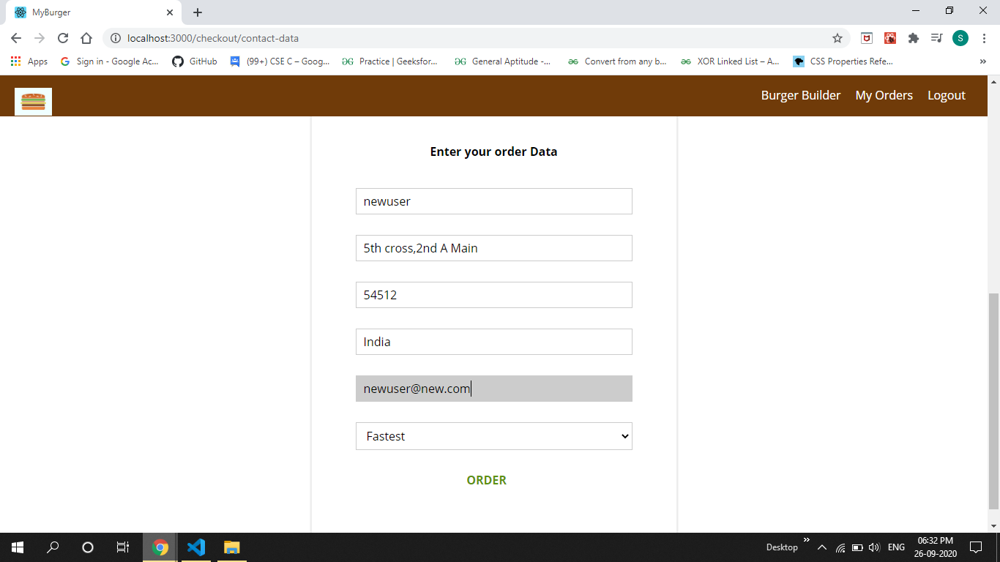
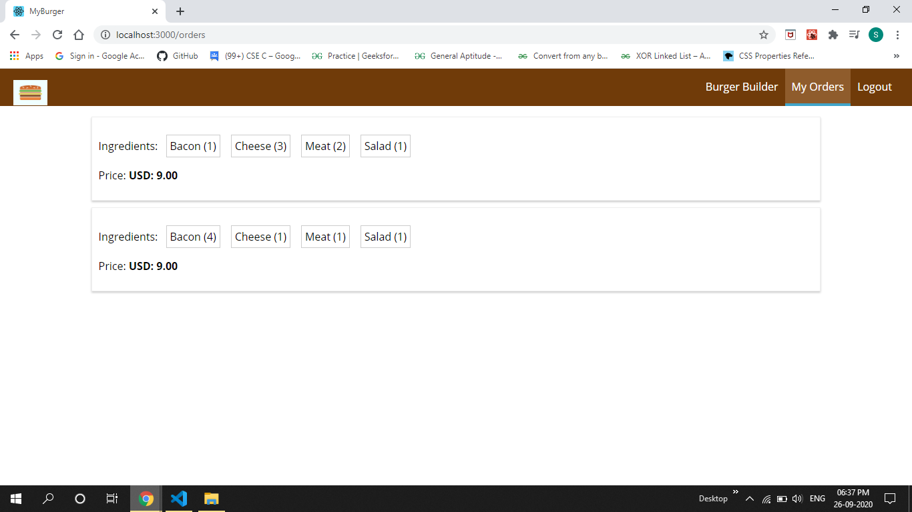

<b>A burger-builder app</b> created using <b>ReactJS</b>.
Users can sign up and login using their email id,password and create and order burgers of their choice.
Firebase is used for authentication as well as to store orders of users.

<h2>Start Screen</h2>

<h2>BurgerBuilder</h2>

<h2>Authentication</h2>

<h2>Checkout</h2>

<h2>Checkout</h2>

<h2>Orders</h2>

